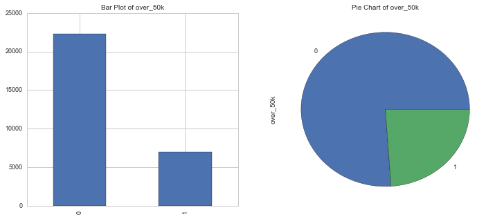
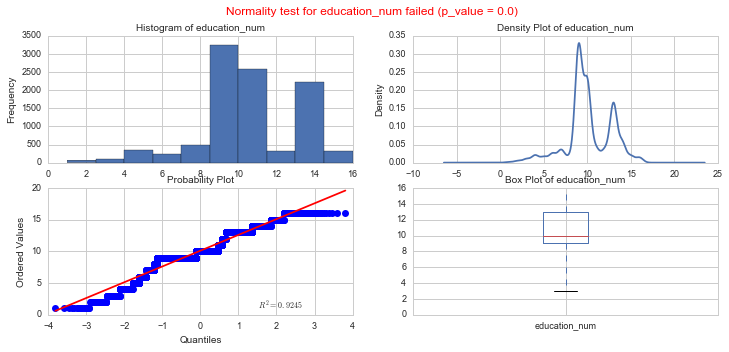
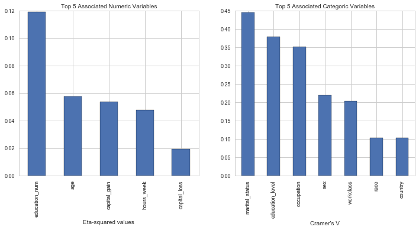
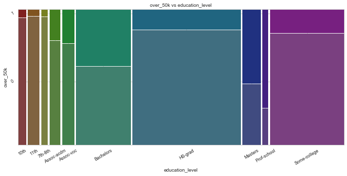
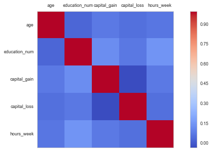
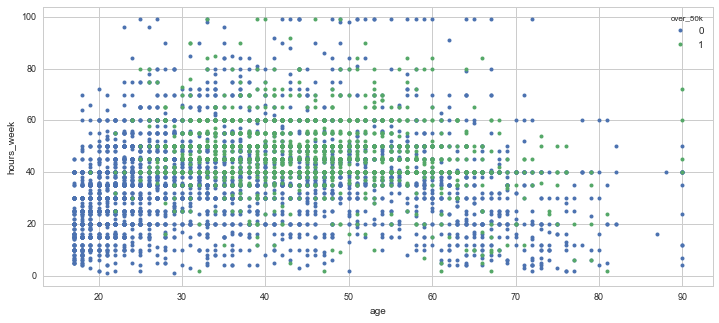

## <a name="read and summarize"></a> Read and Summarize the Data


```python
# Provide the path to the yaml file relative to the working directory
display(HTML('''<style>
    .widget-label { min-width: 20ex !important; }
    .widget-text { min-width: 60ex !important; }
</style>'''))

#Toggle Code
HTML('''<script>
code_show=true; 
function code_toggle() {
 if (code_show){
 $('div.input').hide();

 } else {
 $('div.input').show();

 }
 code_show = !code_show
} 
//$( document ).ready(code_toggle);//commenting code disabling by default
</script>
<form action = "javascript:code_toggle()"><input type="submit" value="Toggle Raw Code"></form>''')
```


<style>
    .widget-label { min-width: 20ex !important; }
    .widget-text { min-width: 60ex !important; }
</style>


<script>
code_show=true; 
function code_toggle() {
 if (code_show){
 $('div.input').hide();

 } else {
 $('div.input').show();

 }
 code_show = !code_show
} 
//$( document ).ready(code_toggle);//commenting code disabling by default
</script>
<form action = "javascript:code_toggle()"><input type="submit" value="Toggle Raw Code"></form>


##### <a name="show hide codes"></a>Press button to toggle code


```python
%%add_conf_code_to_report

conf_dict = ConfUtility.parse_yaml(conf_file)

# Read in data from local file or SQL server
if 'DataSource' not in conf_dict:
    df=pd.read_csv(conf_dict['DataFilePath'], skipinitialspace=True)
else:
    import pyodbc
    cnxn = pyodbc.connect('driver=ODBC Driver 11 for SQL Server;server={};database={};Uid={};Pwd={}'.format(
            conf_dict['Server'], conf_dict['Database'],conf_dict['Username'],conf_dict['Password']))
    df = pd.read_sql(conf_dict['Query'],cnxn)

# Making sure that we are not reading any extra column
df = df[[each for each in df.columns if 'Unnamed' not in each]]

# Sampling Data if data size is larger than 10k
df0 = df # df0 is the unsampled data. Will be used in data exploration and analysis where sampling is not needed
         # However, keep in mind that your final report will always be based on the sampled data. 
if Sample_Size < df.shape[0]:
    df = df.sample(Sample_Size)

# change float data types
if 'FloatDataTypes' in conf_dict:   
    for col_name in conf_dict['FloatDataTypes']:
        df[col_name] = df[col_name].astype(float)      
        
# Getting the list of categorical columns if it was not there in the yaml file
if 'CategoricalColumns' not in conf_dict:
    conf_dict['CategoricalColumns'] = list(set(list(df.select_dtypes(exclude=[np.number]).columns)))

# Getting the list of numerical columns if it was not there in the yaml file
if 'NumericalColumns' not in conf_dict:
    conf_dict['NumericalColumns'] = list(df.select_dtypes(include=[np.number]).columns)    

# Exclude columns that we do not need
if 'ColumnsToExclude' in conf_dict:
    conf_dict['CategoricalColumns'] = list(set(conf_dict['CategoricalColumns'])-set(conf_dict['ColumnsToExclude']))
    conf_dict['NumericalColumns'] = list(set(conf_dict['NumericalColumns'])-set(conf_dict['ColumnsToExclude']))

# Ordering the categorical variables according to the number of unique categories
filtered_cat_columns = []
temp_dict = {}
for cat_var in conf_dict['CategoricalColumns']:
    temp_dict[cat_var] = len(np.unique(df[cat_var]))
sorted_x = sorted(temp_dict.items(), key=operator.itemgetter(0), reverse=True)
conf_dict['CategoricalColumns'] = [x for (x,y) in sorted_x]

ConfUtility.dict_to_htmllist(conf_dict,['Target','CategoricalColumns','NumericalColumns'])
```


<ul><li>Target variable is over_50k</li><li>Categorical Columns are workclass, 
sex, 
race, 
over_50k, 
occupation, 
marital_status, 
education_level, 
country</li><li>Numerical Columns are age, 
education_num, 
capital_gain, 
capital_loss, 
hours_week</li></ul>


### Print the first n (n=5 by default) rows of the data


```python
%%add_conf_code_to_report
def custom_head(df,NoOfRows):
    return HTML(df.head(NoOfRows).style.set_table_attributes("class='table'").render())
i = interact(custom_head,df=fixed(df0), NoOfRows=ipywidgets.IntSlider(min=0, max=30, step=1, \
                                                                     value=5, description='Number of Rows'))
```


        <style  type="text/css" >
        
        
        </style>

        <table id="T_b93d47cf_e29e_11e6_9712_ffc7c6577997" class='table'>
        

        <thead>
            
            <tr>
                
                <th class="blank">
                
                <th class="col_heading level0 col0">id
                
                <th class="col_heading level0 col1">age
                
                <th class="col_heading level0 col2">workclass_id
                
                <th class="col_heading level0 col3">education_level_id
                
                <th class="col_heading level0 col4">education_num
                
                <th class="col_heading level0 col5">marital_status_id
                
                <th class="col_heading level0 col6">occupation_id
                
                <th class="col_heading level0 col7">race_id
                
                <th class="col_heading level0 col8">sex_id
                
                <th class="col_heading level0 col9">capital_gain
                
                <th class="col_heading level0 col10">capital_loss
                
                <th class="col_heading level0 col11">hours_week
                
                <th class="col_heading level0 col12">country_id
                
                <th class="col_heading level0 col13">workclass
                
                <th class="col_heading level0 col14">education_level
                
                <th class="col_heading level0 col15">marital_status
                
                <th class="col_heading level0 col16">occupation
                
                <th class="col_heading level0 col17">race
                
                <th class="col_heading level0 col18">sex
                
                <th class="col_heading level0 col19">country
                
                <th class="col_heading level0 col20">over_50k
                
            </tr>
            
        </thead>
        <tbody>
            
            <tr>
                
                <th id="T_b93d47cf_e29e_11e6_9712_ffc7c6577997" class="row_heading level20 row0">
                    0
                
                <td id="T_b93d47cf_e29e_11e6_9712_ffc7c6577997row0_col0" class="data row0 col0">
                    11289
                
                <td id="T_b93d47cf_e29e_11e6_9712_ffc7c6577997row0_col1" class="data row0 col1">
                    22
                
                <td id="T_b93d47cf_e29e_11e6_9712_ffc7c6577997row0_col2" class="data row0 col2">
                    5
                
                <td id="T_b93d47cf_e29e_11e6_9712_ffc7c6577997row0_col3" class="data row0 col3">
                    16
                
                <td id="T_b93d47cf_e29e_11e6_9712_ffc7c6577997row0_col4" class="data row0 col4">
                    10
                
                <td id="T_b93d47cf_e29e_11e6_9712_ffc7c6577997row0_col5" class="data row0 col5">
                    5
                
                <td id="T_b93d47cf_e29e_11e6_9712_ffc7c6577997row0_col6" class="data row0 col6">
                    2
                
                <td id="T_b93d47cf_e29e_11e6_9712_ffc7c6577997row0_col7" class="data row0 col7">
                    3
                
                <td id="T_b93d47cf_e29e_11e6_9712_ffc7c6577997row0_col8" class="data row0 col8">
                    2
                
                <td id="T_b93d47cf_e29e_11e6_9712_ffc7c6577997row0_col9" class="data row0 col9">
                    0
                
                <td id="T_b93d47cf_e29e_11e6_9712_ffc7c6577997row0_col10" class="data row0 col10">
                    0
                
                <td id="T_b93d47cf_e29e_11e6_9712_ffc7c6577997row0_col11" class="data row0 col11">
                    30
                
                <td id="T_b93d47cf_e29e_11e6_9712_ffc7c6577997row0_col12" class="data row0 col12">
                    7
                
                <td id="T_b93d47cf_e29e_11e6_9712_ffc7c6577997row0_col13" class="data row0 col13">
                    Private
                
                <td id="T_b93d47cf_e29e_11e6_9712_ffc7c6577997row0_col14" class="data row0 col14">
                    Some-college
                
                <td id="T_b93d47cf_e29e_11e6_9712_ffc7c6577997row0_col15" class="data row0 col15">
                    Never-married
                
                <td id="T_b93d47cf_e29e_11e6_9712_ffc7c6577997row0_col16" class="data row0 col16">
                    Adm-clerical
                
                <td id="T_b93d47cf_e29e_11e6_9712_ffc7c6577997row0_col17" class="data row0 col17">
                    Black
                
                <td id="T_b93d47cf_e29e_11e6_9712_ffc7c6577997row0_col18" class="data row0 col18">
                    Male
                
                <td id="T_b93d47cf_e29e_11e6_9712_ffc7c6577997row0_col19" class="data row0 col19">
                    Dominican-Republic
                
                <td id="T_b93d47cf_e29e_11e6_9712_ffc7c6577997row0_col20" class="data row0 col20">
                    0
                
            </tr>
            
            <tr>
                
                <th id="T_b93d47cf_e29e_11e6_9712_ffc7c6577997" class="row_heading level20 row1">
                    1
                
                <td id="T_b93d47cf_e29e_11e6_9712_ffc7c6577997row1_col0" class="data row1 col0">
                    34529
                
                <td id="T_b93d47cf_e29e_11e6_9712_ffc7c6577997row1_col1" class="data row1 col1">
                    43
                
                <td id="T_b93d47cf_e29e_11e6_9712_ffc7c6577997row1_col2" class="data row1 col2">
                    8
                
                <td id="T_b93d47cf_e29e_11e6_9712_ffc7c6577997row1_col3" class="data row1 col3">
                    11
                
                <td id="T_b93d47cf_e29e_11e6_9712_ffc7c6577997row1_col4" class="data row1 col4">
                    16
                
                <td id="T_b93d47cf_e29e_11e6_9712_ffc7c6577997row1_col5" class="data row1 col5">
                    3
                
                <td id="T_b93d47cf_e29e_11e6_9712_ffc7c6577997row1_col6" class="data row1 col6">
                    11
                
                <td id="T_b93d47cf_e29e_11e6_9712_ffc7c6577997row1_col7" class="data row1 col7">
                    5
                
                <td id="T_b93d47cf_e29e_11e6_9712_ffc7c6577997row1_col8" class="data row1 col8">
                    1
                
                <td id="T_b93d47cf_e29e_11e6_9712_ffc7c6577997row1_col9" class="data row1 col9">
                    0
                
                <td id="T_b93d47cf_e29e_11e6_9712_ffc7c6577997row1_col10" class="data row1 col10">
                    0
                
                <td id="T_b93d47cf_e29e_11e6_9712_ffc7c6577997row1_col11" class="data row1 col11">
                    40
                
                <td id="T_b93d47cf_e29e_11e6_9712_ffc7c6577997row1_col12" class="data row1 col12">
                    40
                
                <td id="T_b93d47cf_e29e_11e6_9712_ffc7c6577997row1_col13" class="data row1 col13">
                    State-gov
                
                <td id="T_b93d47cf_e29e_11e6_9712_ffc7c6577997row1_col14" class="data row1 col14">
                    Doctorate
                
                <td id="T_b93d47cf_e29e_11e6_9712_ffc7c6577997row1_col15" class="data row1 col15">
                    Married-civ-spouse
                
                <td id="T_b93d47cf_e29e_11e6_9712_ffc7c6577997row1_col16" class="data row1 col16">
                    Prof-specialty
                
                <td id="T_b93d47cf_e29e_11e6_9712_ffc7c6577997row1_col17" class="data row1 col17">
                    White
                
                <td id="T_b93d47cf_e29e_11e6_9712_ffc7c6577997row1_col18" class="data row1 col18">
                    Female
                
                <td id="T_b93d47cf_e29e_11e6_9712_ffc7c6577997row1_col19" class="data row1 col19">
                    United-States
                
                <td id="T_b93d47cf_e29e_11e6_9712_ffc7c6577997row1_col20" class="data row1 col20">
                    1
                
            </tr>
            
            <tr>
                
                <th id="T_b93d47cf_e29e_11e6_9712_ffc7c6577997" class="row_heading level20 row2">
                    2
                
                <td id="T_b93d47cf_e29e_11e6_9712_ffc7c6577997row2_col0" class="data row2 col0">
                    28681
                
                <td id="T_b93d47cf_e29e_11e6_9712_ffc7c6577997row2_col1" class="data row2 col1">
                    45
                
                <td id="T_b93d47cf_e29e_11e6_9712_ffc7c6577997row2_col2" class="data row2 col2">
                    5
                
                <td id="T_b93d47cf_e29e_11e6_9712_ffc7c6577997row2_col3" class="data row2 col3">
                    10
                
                <td id="T_b93d47cf_e29e_11e6_9712_ffc7c6577997row2_col4" class="data row2 col4">
                    13
                
                <td id="T_b93d47cf_e29e_11e6_9712_ffc7c6577997row2_col5" class="data row2 col5">
                    3
                
                <td id="T_b93d47cf_e29e_11e6_9712_ffc7c6577997row2_col6" class="data row2 col6">
                    5
                
                <td id="T_b93d47cf_e29e_11e6_9712_ffc7c6577997row2_col7" class="data row2 col7">
                    5
                
                <td id="T_b93d47cf_e29e_11e6_9712_ffc7c6577997row2_col8" class="data row2 col8">
                    1
                
                <td id="T_b93d47cf_e29e_11e6_9712_ffc7c6577997row2_col9" class="data row2 col9">
                    0
                
                <td id="T_b93d47cf_e29e_11e6_9712_ffc7c6577997row2_col10" class="data row2 col10">
                    0
                
                <td id="T_b93d47cf_e29e_11e6_9712_ffc7c6577997row2_col11" class="data row2 col11">
                    40
                
                <td id="T_b93d47cf_e29e_11e6_9712_ffc7c6577997row2_col12" class="data row2 col12">
                    40
                
                <td id="T_b93d47cf_e29e_11e6_9712_ffc7c6577997row2_col13" class="data row2 col13">
                    Private
                
                <td id="T_b93d47cf_e29e_11e6_9712_ffc7c6577997row2_col14" class="data row2 col14">
                    Bachelors
                
                <td id="T_b93d47cf_e29e_11e6_9712_ffc7c6577997row2_col15" class="data row2 col15">
                    Married-civ-spouse
                
                <td id="T_b93d47cf_e29e_11e6_9712_ffc7c6577997row2_col16" class="data row2 col16">
                    Exec-managerial
                
                <td id="T_b93d47cf_e29e_11e6_9712_ffc7c6577997row2_col17" class="data row2 col17">
                    White
                
                <td id="T_b93d47cf_e29e_11e6_9712_ffc7c6577997row2_col18" class="data row2 col18">
                    Female
                
                <td id="T_b93d47cf_e29e_11e6_9712_ffc7c6577997row2_col19" class="data row2 col19">
                    United-States
                
                <td id="T_b93d47cf_e29e_11e6_9712_ffc7c6577997row2_col20" class="data row2 col20">
                    1
                
            </tr>
            
            <tr>
                
                <th id="T_b93d47cf_e29e_11e6_9712_ffc7c6577997" class="row_heading level20 row3">
                    3
                
                <td id="T_b93d47cf_e29e_11e6_9712_ffc7c6577997row3_col0" class="data row3 col0">
                    21496
                
                <td id="T_b93d47cf_e29e_11e6_9712_ffc7c6577997row3_col1" class="data row3 col1">
                    41
                
                <td id="T_b93d47cf_e29e_11e6_9712_ffc7c6577997row3_col2" class="data row3 col2">
                    5
                
                <td id="T_b93d47cf_e29e_11e6_9712_ffc7c6577997row3_col3" class="data row3 col3">
                    12
                
                <td id="T_b93d47cf_e29e_11e6_9712_ffc7c6577997row3_col4" class="data row3 col4">
                    9
                
                <td id="T_b93d47cf_e29e_11e6_9712_ffc7c6577997row3_col5" class="data row3 col5">
                    3
                
                <td id="T_b93d47cf_e29e_11e6_9712_ffc7c6577997row3_col6" class="data row3 col6">
                    4
                
                <td id="T_b93d47cf_e29e_11e6_9712_ffc7c6577997row3_col7" class="data row3 col7">
                    5
                
                <td id="T_b93d47cf_e29e_11e6_9712_ffc7c6577997row3_col8" class="data row3 col8">
                    2
                
                <td id="T_b93d47cf_e29e_11e6_9712_ffc7c6577997row3_col9" class="data row3 col9">
                    0
                
                <td id="T_b93d47cf_e29e_11e6_9712_ffc7c6577997row3_col10" class="data row3 col10">
                    0
                
                <td id="T_b93d47cf_e29e_11e6_9712_ffc7c6577997row3_col11" class="data row3 col11">
                    45
                
                <td id="T_b93d47cf_e29e_11e6_9712_ffc7c6577997row3_col12" class="data row3 col12">
                    40
                
                <td id="T_b93d47cf_e29e_11e6_9712_ffc7c6577997row3_col13" class="data row3 col13">
                    Private
                
                <td id="T_b93d47cf_e29e_11e6_9712_ffc7c6577997row3_col14" class="data row3 col14">
                    HS-grad
                
                <td id="T_b93d47cf_e29e_11e6_9712_ffc7c6577997row3_col15" class="data row3 col15">
                    Married-civ-spouse
                
                <td id="T_b93d47cf_e29e_11e6_9712_ffc7c6577997row3_col16" class="data row3 col16">
                    Craft-repair
                
                <td id="T_b93d47cf_e29e_11e6_9712_ffc7c6577997row3_col17" class="data row3 col17">
                    White
                
                <td id="T_b93d47cf_e29e_11e6_9712_ffc7c6577997row3_col18" class="data row3 col18">
                    Male
                
                <td id="T_b93d47cf_e29e_11e6_9712_ffc7c6577997row3_col19" class="data row3 col19">
                    United-States
                
                <td id="T_b93d47cf_e29e_11e6_9712_ffc7c6577997row3_col20" class="data row3 col20">
                    0
                
            </tr>
            
            <tr>
                
                <th id="T_b93d47cf_e29e_11e6_9712_ffc7c6577997" class="row_heading level20 row4">
                    4
                
                <td id="T_b93d47cf_e29e_11e6_9712_ffc7c6577997row4_col0" class="data row4 col0">
                    27291
                
                <td id="T_b93d47cf_e29e_11e6_9712_ffc7c6577997row4_col1" class="data row4 col1">
                    56
                
                <td id="T_b93d47cf_e29e_11e6_9712_ffc7c6577997row4_col2" class="data row4 col2">
                    5
                
                <td id="T_b93d47cf_e29e_11e6_9712_ffc7c6577997row4_col3" class="data row4 col3">
                    12
                
                <td id="T_b93d47cf_e29e_11e6_9712_ffc7c6577997row4_col4" class="data row4 col4">
                    9
                
                <td id="T_b93d47cf_e29e_11e6_9712_ffc7c6577997row4_col5" class="data row4 col5">
                    3
                
                <td id="T_b93d47cf_e29e_11e6_9712_ffc7c6577997row4_col6" class="data row4 col6">
                    5
                
                <td id="T_b93d47cf_e29e_11e6_9712_ffc7c6577997row4_col7" class="data row4 col7">
                    5
                
                <td id="T_b93d47cf_e29e_11e6_9712_ffc7c6577997row4_col8" class="data row4 col8">
                    2
                
                <td id="T_b93d47cf_e29e_11e6_9712_ffc7c6577997row4_col9" class="data row4 col9">
                    0
                
                <td id="T_b93d47cf_e29e_11e6_9712_ffc7c6577997row4_col10" class="data row4 col10">
                    0
                
                <td id="T_b93d47cf_e29e_11e6_9712_ffc7c6577997row4_col11" class="data row4 col11">
                    40
                
                <td id="T_b93d47cf_e29e_11e6_9712_ffc7c6577997row4_col12" class="data row4 col12">
                    40
                
                <td id="T_b93d47cf_e29e_11e6_9712_ffc7c6577997row4_col13" class="data row4 col13">
                    Private
                
                <td id="T_b93d47cf_e29e_11e6_9712_ffc7c6577997row4_col14" class="data row4 col14">
                    HS-grad
                
                <td id="T_b93d47cf_e29e_11e6_9712_ffc7c6577997row4_col15" class="data row4 col15">
                    Married-civ-spouse
                
                <td id="T_b93d47cf_e29e_11e6_9712_ffc7c6577997row4_col16" class="data row4 col16">
                    Exec-managerial
                
                <td id="T_b93d47cf_e29e_11e6_9712_ffc7c6577997row4_col17" class="data row4 col17">
                    White
                
                <td id="T_b93d47cf_e29e_11e6_9712_ffc7c6577997row4_col18" class="data row4 col18">
                    Male
                
                <td id="T_b93d47cf_e29e_11e6_9712_ffc7c6577997row4_col19" class="data row4 col19">
                    United-States
                
                <td id="T_b93d47cf_e29e_11e6_9712_ffc7c6577997row4_col20" class="data row4 col20">
                    1
                
            </tr>
            
        </tbody>
        </table>
        


### Print the dimensions of the data (rows, columns)
Note: this represents only the training set


```python
%%add_conf_code_to_report
print 'The data has {} Rows and {} columns'.format(df0.shape[0],df0.shape[1])
```

    The data has 29305 Rows and 21 columns
    

### Print the column types


```python
%%add_conf_code_to_report
print("The types of columns are:")
df.dtypes
```

    The types of columns are:
    


    id                     int64
    age                    int64
    workclass_id           int64
    education_level_id     int64
    education_num          int64
    marital_status_id      int64
    occupation_id          int64
    race_id                int64
    sex_id                 int64
    capital_gain           int64
    capital_loss           int64
    hours_week             int64
    country_id             int64
    workclass             object
    education_level       object
    marital_status        object
    occupation            object
    race                  object
    sex                   object
    country               object
    over_50k               int64
    dtype: object


## <a name="individual variable"></a>Extract Descriptive Statistics of Each Column


```python
%%add_conf_code_to_report
def num_missing(x):
    return len(x.index)-x.count()

def num_unique(x):
    return len(np.unique(x))

temp_df = df0.describe().T
missing_df = pd.DataFrame(df0.apply(num_missing, axis=0)) 
missing_df.columns = ['missing']
unq_df = pd.DataFrame(df0.apply(num_unique, axis=0))
unq_df.columns = ['unique']
types_df = pd.DataFrame(df0.dtypes)
types_df.columns = ['DataType']
```

### Print the descriptive statistics of numerical columns
Descriptive stats for most id variables aren't relevant (except in the case where they represent an ordinal classification)


```python
%%add_conf_code_to_report
summary_df = temp_df.join(missing_df).join(unq_df).join(types_df)
summary_df
```


<div>
<table border="1" class="dataframe">
  <thead>
    <tr style="text-align: right;">
      <th></th>
      <th>count</th>
      <th>mean</th>
      <th>std</th>
      <th>min</th>
      <th>25%</th>
      <th>50%</th>
      <th>75%</th>
      <th>max</th>
      <th>missing</th>
      <th>unique</th>
      <th>DataType</th>
    </tr>
  </thead>
  <tbody>
    <tr>
      <th>id</th>
      <td>29305.0</td>
      <td>24550.842314</td>
      <td>14092.528794</td>
      <td>2.0</td>
      <td>12394.0</td>
      <td>24551.0</td>
      <td>36763.0</td>
      <td>48840.0</td>
      <td>0</td>
      <td>29305</td>
      <td>int64</td>
    </tr>
    <tr>
      <th>age</th>
      <td>29305.0</td>
      <td>38.695444</td>
      <td>13.723411</td>
      <td>17.0</td>
      <td>28.0</td>
      <td>37.0</td>
      <td>48.0</td>
      <td>90.0</td>
      <td>0</td>
      <td>74</td>
      <td>int64</td>
    </tr>
    <tr>
      <th>workclass_id</th>
      <td>29305.0</td>
      <td>4.867941</td>
      <td>1.469535</td>
      <td>1.0</td>
      <td>5.0</td>
      <td>5.0</td>
      <td>5.0</td>
      <td>9.0</td>
      <td>0</td>
      <td>9</td>
      <td>int64</td>
    </tr>
    <tr>
      <th>education_level_id</th>
      <td>29305.0</td>
      <td>11.281727</td>
      <td>3.873239</td>
      <td>1.0</td>
      <td>10.0</td>
      <td>12.0</td>
      <td>13.0</td>
      <td>16.0</td>
      <td>0</td>
      <td>16</td>
      <td>int64</td>
    </tr>
    <tr>
      <th>education_num</th>
      <td>29305.0</td>
      <td>10.081283</td>
      <td>2.577030</td>
      <td>1.0</td>
      <td>9.0</td>
      <td>10.0</td>
      <td>12.0</td>
      <td>16.0</td>
      <td>0</td>
      <td>16</td>
      <td>int64</td>
    </tr>
    <tr>
      <th>marital_status_id</th>
      <td>29305.0</td>
      <td>3.616618</td>
      <td>1.512886</td>
      <td>1.0</td>
      <td>3.0</td>
      <td>3.0</td>
      <td>5.0</td>
      <td>7.0</td>
      <td>0</td>
      <td>7</td>
      <td>int64</td>
    </tr>
    <tr>
      <th>occupation_id</th>
      <td>29305.0</td>
      <td>7.570824</td>
      <td>4.228902</td>
      <td>1.0</td>
      <td>4.0</td>
      <td>8.0</td>
      <td>11.0</td>
      <td>15.0</td>
      <td>0</td>
      <td>15</td>
      <td>int64</td>
    </tr>
    <tr>
      <th>race_id</th>
      <td>29305.0</td>
      <td>4.666542</td>
      <td>0.847614</td>
      <td>1.0</td>
      <td>5.0</td>
      <td>5.0</td>
      <td>5.0</td>
      <td>5.0</td>
      <td>0</td>
      <td>5</td>
      <td>int64</td>
    </tr>
    <tr>
      <th>sex_id</th>
      <td>29305.0</td>
      <td>1.665996</td>
      <td>0.471649</td>
      <td>1.0</td>
      <td>1.0</td>
      <td>2.0</td>
      <td>2.0</td>
      <td>2.0</td>
      <td>0</td>
      <td>2</td>
      <td>int64</td>
    </tr>
    <tr>
      <th>capital_gain</th>
      <td>29305.0</td>
      <td>1123.151203</td>
      <td>7652.925099</td>
      <td>0.0</td>
      <td>0.0</td>
      <td>0.0</td>
      <td>0.0</td>
      <td>99999.0</td>
      <td>0</td>
      <td>117</td>
      <td>int64</td>
    </tr>
    <tr>
      <th>capital_loss</th>
      <td>29305.0</td>
      <td>86.823170</td>
      <td>401.457657</td>
      <td>0.0</td>
      <td>0.0</td>
      <td>0.0</td>
      <td>0.0</td>
      <td>4356.0</td>
      <td>0</td>
      <td>89</td>
      <td>int64</td>
    </tr>
    <tr>
      <th>hours_week</th>
      <td>29305.0</td>
      <td>40.370858</td>
      <td>12.401778</td>
      <td>1.0</td>
      <td>40.0</td>
      <td>40.0</td>
      <td>45.0</td>
      <td>99.0</td>
      <td>0</td>
      <td>92</td>
      <td>int64</td>
    </tr>
    <tr>
      <th>country_id</th>
      <td>29305.0</td>
      <td>37.759085</td>
      <td>7.764943</td>
      <td>1.0</td>
      <td>40.0</td>
      <td>40.0</td>
      <td>40.0</td>
      <td>42.0</td>
      <td>0</td>
      <td>41</td>
      <td>int64</td>
    </tr>
    <tr>
      <th>over_50k</th>
      <td>29305.0</td>
      <td>0.239277</td>
      <td>0.426649</td>
      <td>0.0</td>
      <td>0.0</td>
      <td>0.0</td>
      <td>0.0</td>
      <td>1.0</td>
      <td>0</td>
      <td>2</td>
      <td>int64</td>
    </tr>
  </tbody>
</table>
</div>


### Print the descriptive statistics of categorical columns


```python
%%add_conf_code_to_report
col_names = list(types_df.index) #Get all col names
num_cols = len(col_names)
index = range(num_cols)
cat_index = []
for i in index: #Find the indices of columns in Categorical columns
    if col_names[i] in conf_dict['CategoricalColumns']:
        cat_index.append(i)
summary_df_cat = missing_df.join(unq_df).join(types_df.iloc[cat_index], how='inner') #Only summarize categorical columns
summary_df_cat
```


<div>
<table border="1" class="dataframe">
  <thead>
    <tr style="text-align: right;">
      <th></th>
      <th>missing</th>
      <th>unique</th>
      <th>DataType</th>
    </tr>
  </thead>
  <tbody>
    <tr>
      <th>workclass</th>
      <td>0</td>
      <td>9</td>
      <td>object</td>
    </tr>
    <tr>
      <th>education_level</th>
      <td>0</td>
      <td>16</td>
      <td>object</td>
    </tr>
    <tr>
      <th>marital_status</th>
      <td>0</td>
      <td>7</td>
      <td>object</td>
    </tr>
    <tr>
      <th>occupation</th>
      <td>0</td>
      <td>15</td>
      <td>object</td>
    </tr>
    <tr>
      <th>race</th>
      <td>0</td>
      <td>5</td>
      <td>object</td>
    </tr>
    <tr>
      <th>sex</th>
      <td>0</td>
      <td>2</td>
      <td>object</td>
    </tr>
    <tr>
      <th>country</th>
      <td>0</td>
      <td>41</td>
      <td>object</td>
    </tr>
    <tr>
      <th>over_50k</th>
      <td>0</td>
      <td>2</td>
      <td>int64</td>
    </tr>
  </tbody>
</table>
</div>


### Explore the target variable


```python
md_text = '## Target Variable'
filename = 'tmp/target_variables.csv'
export_filename = 'target_report2.ipynb'

if conf_dict['Target'] in conf_dict['CategoricalColumns']:
    w1_value,w2_value,w3_value = '','',''
    w1, w2, w3, w4 = None, None, None, None
    silentremove(filename)    
    w1 = widgets.Dropdown(
        options=[conf_dict['Target']],
        value=conf_dict['Target'],
        description='Target Variable:',
    )

    ReportMagic.var_files = filename
    w_export = widgets.Button(description='Export', value='Export')
    handle_export_partial = partial(handle_export, w1=w1, w2=w2, w3=w3, export_filename=export_filename, md_text=md_text)      
    w1.observe(handle_change,'value')
    w_export.on_click(handle_export_partial)

    %reset_report
    %add_interaction_code_to_report i = interactive(TargetAnalytics.custom_barplot, df=fixed(df), \
                                                    filename=fixed(filename), col1=w1, Export=w_export)
    hbox = widgets.HBox(i.children)
    display(hbox)
    hbox.on_displayed(TargetAnalytics.custom_barplot(df=df0, filename=filename, col1=w1.value, Export=w_export))
else:
    w1_value, w2_value, w3_value = '', '', ''
    w1, w2, w3, w4 = None, None, None, None
    silentremove(filename) 
    w1 = widgets.Dropdown(
            options=[conf_dict['Target']],
            value=conf_dict['Target'],
            description='Target Variable:',
        )
    w_export = widgets.Button(description='Export', value='Export')
    handle_export_partial = partial(handle_export, w1=w1, w2=w2, w3=w3, export_filename=export_filename, md_text=md_text)       
    w1.observe(handle_change,'value')
    w_export.on_click(handle_export_partial)

    %reset_report
    %add_interaction_code_to_report i = interactive(NumericAnalytics.custom_barplot, df=fixed(df), filename=fixed(filename),\
                                                    col1=w1, Export=w_export)
    hbox = widgets.HBox(i.children)
    display(hbox)
    hbox.on_displayed(NumericAnalytics.custom_barplot(df=df, filename=filename, col1=w1.value, Export=w_export))
```





### Explore individual numeric variables and test for normality (on sampled data)


```python
md_text = '## Visualize Individual Numerical Variables (on Sampled Data)'
filename = ReportMagic.var_files='tmp/numeric_variables.csv'
export_filename = 'numeric_report2.ipynb'
w1_value, w2_value, w3_value = '', '', ''
w1, w2, w3, w4 = None, None, None, None
silentremove(filename) 
w1 = widgets.Dropdown(
        options=conf_dict['NumericalColumns'],
        value=conf_dict['NumericalColumns'][0],
        description='Numeric Variable:',
    )
w_export = widgets.Button(description='Export', value='Export')
handle_export_partial = partial(handle_export, w1=w1, w2=w2, w3=w3, export_filename=export_filename, md_text=md_text)       
w1.observe(handle_change,'value')
w_export.on_click(handle_export_partial)

%reset_report
%add_interaction_code_to_report i = interactive(NumericAnalytics.custom_barplot, df=fixed(df), filename=fixed(filename),\
                                                col1=w1, Export=w_export)
hbox = widgets.HBox(i.children)
display(hbox)
hbox.on_displayed(NumericAnalytics.custom_barplot(df=df, filename=filename, col1=w1.value, Export=w_export))
```





## <a name="multiple variables"></a>Explore Interactions Between Variables

### <a name="rank variables"></a>Rank variables based on linear relationships with reference variable (on sampled data)


```python
md_text = '## Rank variables based on linear relationships with reference variable (on sampled data)'
filename = ReportMagic.var_files='tmp/rank_associations.csv'
export_filename = 'rank_report2.ipynb'
silentremove(filename)
cols_list = [conf_dict['Target']] + conf_dict['NumericalColumns'] + conf_dict['CategoricalColumns'] #Make target the default reference variable
cols_list = list(OrderedDict.fromkeys(cols_list)) #remove variables that might be duplicates with target
w1 = widgets.Dropdown(    
    options=cols_list,
    value=cols_list[0],
    description='Ref Var:'
)
w2 = ipywidgets.Text(value="5", description='Top Num Vars:')
w3 = ipywidgets.Text(value="5", description='Top Cat Vars:')
w_export = widgets.Button(description='Export', value='Export')
handle_export_partial = partial(handle_export, w1=w1, w2=w2, w3=w3, export_filename=export_filename, md_text=md_text)
w1.observe (handle_change,'value')
w_export.on_click(handle_export_partial)

%reset_report
%add_interaction_code_to_report i = interactive(InteractionAnalytics.rank_associations, df=fixed(df), \
                                                conf_dict=fixed(conf_dict), col1=w1, col2=w2, col3=w3, Export=w_export)
hbox = widgets.HBox(i.children)
display(hbox)
hbox.on_displayed(InteractionAnalytics.rank_associations(df=df, conf_dict=conf_dict, col1=w1.value, \
                                                         col2=w2.value, col3=w3.value, Export=w_export))
```





### <a name="two categorical"></a>Explore interactions between categorical variables


```python
md_text = '## Interaction between categorical variables'
filename = ReportMagic.var_files='tmp/cat_interactions.csv'
export_filename = 'cat_interactions_report2.ipynb'
silentremove(filename) 
w1, w2, w3, w4 = None, None, None, None

if conf_dict['Target'] in conf_dict['CategoricalColumns']:
    cols_list = [conf_dict['Target']] + conf_dict['CategoricalColumns'] #Make target the default reference variable
    cols_list = list(OrderedDict.fromkeys(cols_list)) #remove variables that might be duplicates with target
else:
    cols_list = conf_dict['CategoricalColumns']
    
w1 = widgets.Dropdown(
    options=cols_list,
    value=cols_list[0],
    description='Categorical Var 1:'
)
w2 = widgets.Dropdown(
    options=cols_list,
    value=cols_list[1],
    description='Categorical Var 2:'
)
w_export = widgets.Button(description='Export', value="Export")
handle_export_partial = partial(handle_export, w1=w1, w2=w2, w3=w3, export_filename=export_filename, md_text=md_text)       
w1.observe(handle_change,'value')
w2.observe(handle_change,'value')
w_export.on_click(handle_export_partial)

%reset_report
%add_interaction_code_to_report i = interactive(InteractionAnalytics.categorical_relations, df=fixed(df), \
                                         filename=fixed(filename), col1=w1, col2=w2, Export=w_export)
hbox = widgets.HBox(i.children)
display(hbox)
hbox.on_displayed(InteractionAnalytics.categorical_relations(df=df0, filename=filename, col1=w1.value, \
                                                             col2=w2.value, Export=w_export))
```





### Explore correlation matrix between numerical variables


```python
md_text = '## Explore correlation matrix between numerical variables'
filename = ReportMagic.var_files='tmp/numerical_corr.csv'
export_filename = 'numerical_correlations_report2.ipynb'
silentremove(filename) 
w1, w2, w3, w4 = None, None, None, None
w1 = widgets.Dropdown(
    options=['pearson','kendall','spearman'],
    value='pearson',
    description='Correlation Method:'
)
w_export = widgets.Button(description='Export', value='Export')
handle_export_partial = partial(handle_export, w1=w1, w2=w2, w3=w3, export_filename=export_filename, md_text=md_text)       
w1.observe(handle_change,'value')
w_export.on_click(handle_export_partial)

%reset_report
%add_interaction_code_to_report i = interactive(InteractionAnalytics.numerical_correlation,df=fixed(df), conf_dict=fixed(conf_dict),\
                                         col1=w1, Export=w_export)

hbox = widgets.HBox(i.children)
display(hbox)
hbox.on_displayed(InteractionAnalytics.numerical_correlation(df0, conf_dict=conf_dict, col1=w1.value, Export=w_export))
```





### <a name="two numerical and categorical"></a>Explore interactions between two numerical variables and a categorical variable (on sampled data)


```python
md_text = '## Explore interactions between two numerical variables and a categorical variable (on sampled data)'
filename = ReportMagic.var_files='tmp/nnc_int.csv'
export_filename = 'nnc_report2.ipynb'
silentremove(filename) 
w1, w2, w3, w4 = None, None, None, None

if conf_dict['Target'] in conf_dict['NumericalColumns']:
    cols_list = [conf_dict['Target']] + conf_dict['NumericalColumns'] #Make target the default reference variable
    cols_list = list(OrderedDict.fromkeys(cols_list)) #remove variables that might be duplicates with target
else:
    cols_list = conf_dict['NumericalColumns']
    
w1 = widgets.Dropdown(
    options = cols_list,
    value = cols_list[0],
    description = 'Numerical Var 1:'
)
w2 = widgets.Dropdown(
    options = cols_list,
    value = cols_list[1],
    description = 'Numerical Var 2:'
)

if conf_dict['Target'] in conf_dict['CategoricalColumns']:
    cols_list = [conf_dict['Target']] + conf_dict['CategoricalColumns'] #Make target the default reference variable
    cols_list = list(OrderedDict.fromkeys(cols_list)) #remove variables that might be duplicates with target
else:
    cols_list = conf_dict['CategoricalColumns']
    
w3 = widgets.Dropdown(
    options = cols_list,
    value = cols_list[0],
    description = 'Legend Cat Var:'
)
w_export = widgets.Button(description='Export', value=False, options=[True, False])
handle_export_partial = partial(handle_export, w1=w1, w2=w2, w3=w3, export_filename=export_filename, md_text=md_text)       
w1.observe(handle_change,'value')
w_export.on_click(handle_export_partial)

%reset_report
%add_interaction_code_to_report i = interactive(InteractionAnalytics.nnc_relation, df=fixed(df),\
                                                conf_dict=fixed(conf_dict), col1=w1, col2=w2, col3=w3, Export=w_export)
hbox = widgets.HBox(i.children)
display(hbox)
hbox.on_displayed(InteractionAnalytics.nnc_relation(df, conf_dict, col1=w1.value,\
                                                    col2=w2.value, col3=w3.value, Export=w_export))
```





```python

```
